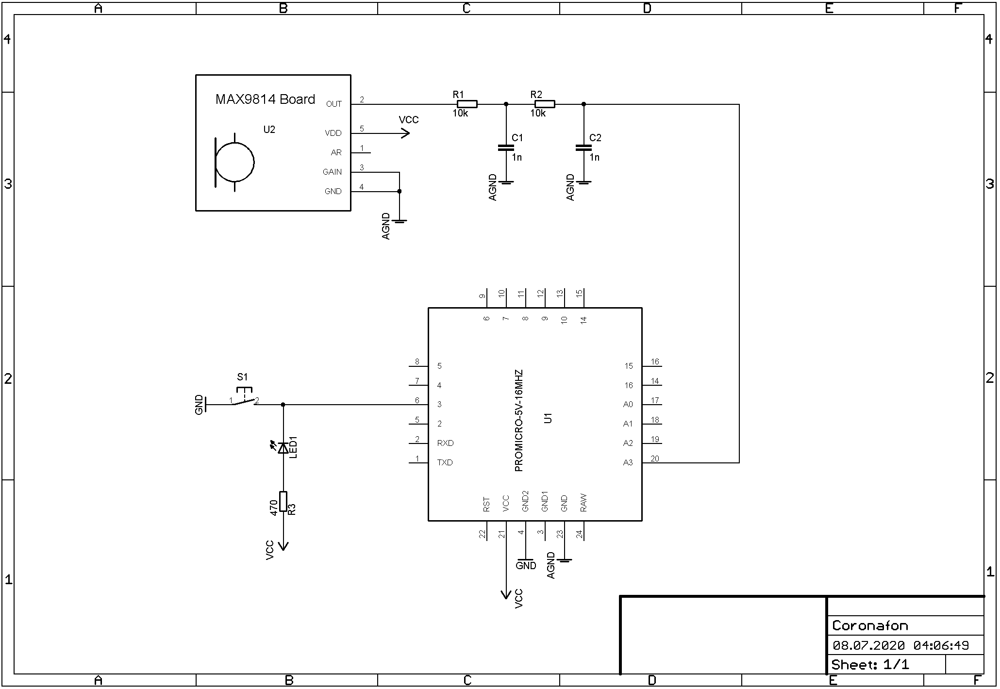

# Coronafon

A bare bone Push To Talk USB-microphone.

More or less just the LUFA USB audio device sample enhanced by analog
sampling and an enhanced microphone "shield".
No driver installation is needed.

Beside the schematic being so simple this USB-microphone is immediately
recognized by Win10 and cooperates with all major brand audio/video sharing
platforms.
What shall they do else with a regular USB-microphone?
The audio quality is surprisingly good and several feedbacks confirm it
is comparable with way higher priced industry products.
Maybe some initial mismatch until the audio chat app has adjusted to the
mic takes a fraction of a second and could get some more attention.

## Why?

Microphones build into the computer are fine but there is no control who
listens to you when you do not excpect it. To get back privacy the
internal mics are reliably disabled.

With the Coronafon a pushbutton gives ultimate control if the computer
is allowed to listen - until you simply unplug it.

## How does it work?

Check the LUFA sample for details on USB.
The audio control is quite simple.
Let the ADC of the AVR sample the audio.
If the pushbutton is enganged feed those samples to the USB.
If not, just feed a zero to the USB; and get your audio chat app
claiming about this extreme silence :badgrin:.

Since there is no way to enter into the booloader from the microphone
code, there is also no way for hackers to get the ProMicro reflashed
without your awareness.
A physical hardware reset of the board is necessary to get into the
bootloader, if the ProMicro should get reused by another project.

## How to compile the code?

Use the plain old WinAVR toolchain and the makefile provided.
Alternatively you might want to use the plain hex file straight
out of the repo folder.

## How to get the compiled code to the ProMicro board?

Adjust the COM-port settings inside flash_it.bat to match your setup, then
run this batchfile from the console.
The hardest part is figuring out which COM port it got assigned to when
in bootloading mode.
Maybe a hardware reset needs to be given before reflashing is started.
Of course, Caterina (Arduino bootloader) needs to reside there.

## Parts list:

1 x Sparkfun ProMicro, Arduino Leonardo, PRJC Teeny 2.0, ... 16 MHz variant  
1 x MAX9814 microphone breakout board  
1 x pushbutton  
2 x 10kOhms, 5% but tolerance does not matter  
2 x 1nF, >10V (just to be sure), 10% but tolerance does not matter  
"On Air" LED and its resistor are optional  

## How to rig up the components?

The MAX9814 is adjusted to mid range gain. The RC low pass filter cares
for anti aliasing. Without this simple filter the noise floor of the
digitized sound will rise dramatically.
A setup on a solderless breadboard just will do.

## The name?

Well, this makeshift thing got very handy during some pandemic lockdowns
and remote work sessions.

## Credits:

Dean Camera, LUFA project
https://www.fourwalledcubicle.com/LUFA.php
